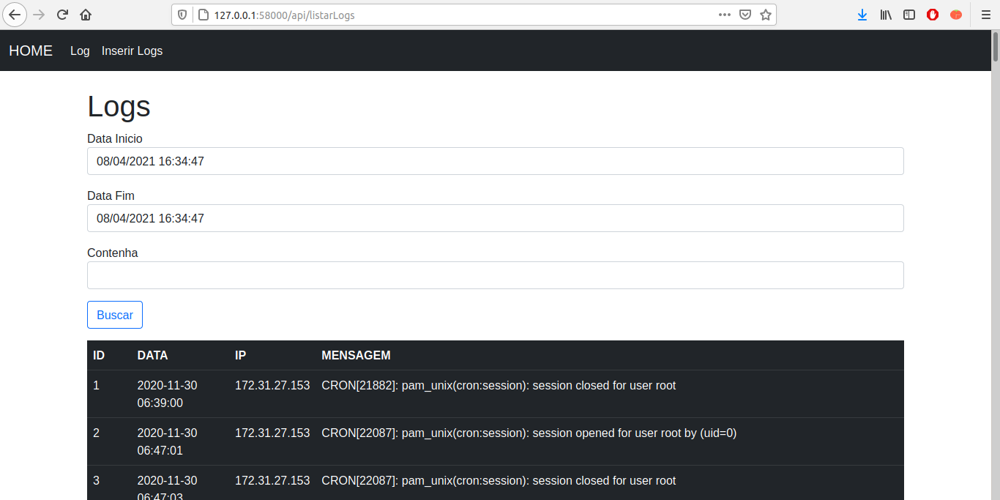
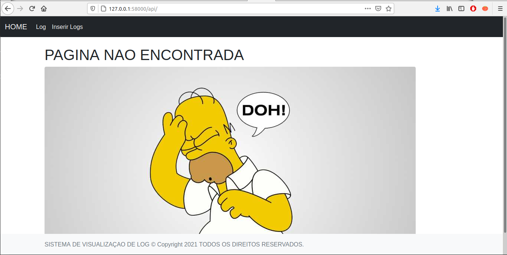
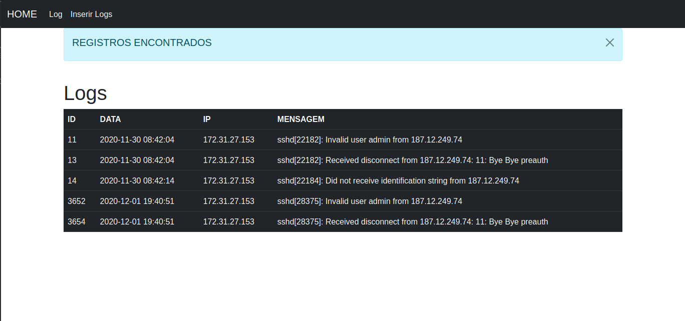

# <h2> DESAFIO REAL PROTECT - Feito em Python usando Flask e MySQL </h2> 

##

<h4> TELA FILTRO LOGS </h4>

 Na tela de FILTRO LOGS o usuario podera realizar as seguinte açao abaixo. 

<ul>

<li> Visualizar o resultado da busca de log de acordo com o filtro de data inicio, data fim e contenha. </li>

</ul>

## 

<h4> TELA NOT FOUND </h4>

 Na tela de NOT FOUND 404 exibira a imagem do homer 

##

<h4> TELA RESULTADO BUSCA </h4>

 Na tela de RESULTADO o usuario podera realizar as seguinte açao abaixo. 

<ul>

<li> Visualizar o resultado da busca de log. </li>

</ul>

## 

